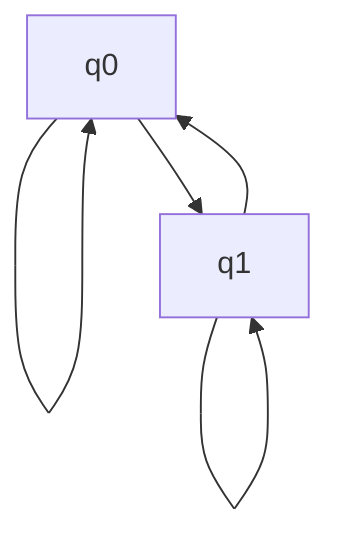

# Teoria computacional

## Teoria de complejidad

### Notacion Big O

La notacion Big O se utiliza para describir el comportamiento asintotico de una funcion en terminos de otra funcion. La notacion Big O se puede expresar de la siguiente manera:

- Una funcion f(n) es O(g(n)) si existe una constante c y un entero n0 tal que para todo n mayor o igual a n0, el valor absoluto de f(n) es menor o igual a c por el valor absoluto de g(n):
  
  - |f(n)| <= c * |g(n)|, para todo n >= n0

Donde:

- f(n) es la funcion que se quiere analizar.
- g(n) es la funcion de referencia.
- c es una constante positiva.
- n0 es un entero positivo.

La notacion Big O se utiliza para describir el comportamiento asintotico de una funcion en terminos de otra funcion. La notacion Big O se puede expresar de la siguiente manera:

- Una funcion f(n) es O(g(n)) si existe una constante c y un entero n0 tal que para todo n mayor o igual a n0, el valor absoluto de f(n) es menor o igual a c por el valor absoluto de g(n):
  
  - |f(n)| <= c * |g(n)|, para todo n >= n0

Donde:

- f(n) es la funcion que se quiere analizar.
- g(n) es la funcion de referencia.
- c es una constante positiva.
- n0 es un entero positivo.

### Formalidad

Big-O - O
Omega - Ω
Theta - Θ
Little-O - o

### Comparativa de complejidad de Big-O

- O(1) - Constante
- O(log n) - Logaritmica
- O(n) - Lineal
- O(n log n) - Logaritmica lineal
- O(n^2) - Cuadratica
- O(n^3) - Cubica
- O(2^n) - Exponencial
- O(n!) - Factorial

### Algoritmos de ordenamiento de matrices

#### Bubble sort

El algoritmo de ordenamiento de matrices bubble sort es un algoritmo de ordenamiento que compara pares de elementos adyacentes y los intercambia si estan en el orden incorrecto. El algoritmo de ordenamiento de matrices bubble sort se puede expresar de la siguiente manera:

- Para cada elemento i desde 0 hasta n-1:
  - Para cada elemento j desde 0 hasta n-i-1:
    - Si el elemento j es mayor que el elemento j+1:
      - Intercambiar el elemento j con el elemento j+1

Donde:

- n es el numero de elementos en la matriz.

#### Insertion sort

El algoritmo de ordenamiento de matrices insertion sort es un algoritmo de ordenamiento que divide la matriz en dos partes: una parte ordenada y una parte desordenada. El algoritmo de ordenamiento de matrices insertion sort se puede expresar de la siguiente manera:

- Para cada elemento i desde 1 hasta n-1:
  - Guardar el elemento i en una variable temporal.
  - Mientras j sea mayor o igual a 0 y el elemento j sea mayor que el elemento temporal:
    - Mover el elemento j a la derecha.
    - Decrementar j en 1.
  - Asignar el elemento temporal al elemento j+1.

Donde:

- n es el numero de elementos en la matriz.

#### Merge sort

El algoritmo de ordenamiento de matrices merge sort es un algoritmo de ordenamiento que divide la matriz en dos partes, ordena cada parte por separado y luego combina las partes ordenadas. El algoritmo de ordenamiento de matrices merge sort se puede expresar de la siguiente manera:

- Si la matriz tiene mas de un elemento:
  - Dividir la matriz en dos partes.
  - Ordenar cada parte por separado.
  - Combinar las partes ordenadas.

#### Quick sort

El algoritmo de ordenamiento de matrices quick sort es un algoritmo de ordenamiento que elige un elemento como pivote y particiona la matriz en dos partes: una parte con elementos menores que el pivote y otra parte con elementos mayores que el pivote. El algoritmo de ordenamiento de matrices quick sort se puede expresar de la siguiente manera:

- Elegir un elemento como pivote.
- Particionar la matriz en dos partes: una parte con elementos menores que el pivote y otra parte con elementos mayores que el pivote.
- Ordenar cada parte por separado.

## Gramatica y lenguajes formales

### Lenguaje

Un lenguaje es un conjunto de cadenas de simbolos. Un lenguaje puede ser finito o infinito. Un lenguaje finito es un conjunto de cadenas de simbolos de longitud finita. Un lenguaje infinito es un conjunto de cadenas de simbolos de longitud infinita.

## Maquinas de estado finito

Una maquina de estado finito es un modelo matematico que se utiliza para describir el comportamiento de un sistema. Una maquina de estado finito se puede expresar de la siguiente manera:

- Una maquina de estado finito se compone de un conjunto finito de estados, un conjunto finito de simbolos de entrada, un conjunto finito de simbolos de salida, una funcion de transicion, y una funcion de salida.

Tabla

| Estado actual | Simbolo de entrada | Estado siguiente | Simbolo de salida |
|---------------|--------------------|------------------|-------------------|
| q0            | 0                  | q1               | 0                 |
| q0            | 1                  | q0               | 1                 |
| q1            | 0                  | q1               | 1                 |
| q1            | 1                  | q0               | 0                 |

Grafico

## Teoria de computabilidad

### Maquinas de Turing

Una maquina de Turing es un modelo matematico que se utiliza para describir el comportamiento de un algoritmo. Una maquina de Turing se puede expresar de la siguiente manera:

- Una maquina de Turing se compone de un conjunto finito de estados, un conjunto finito de simbolos de entrada, un conjunto finito de simbolos de salida, una cinta infinita, una cabeza de lectura/escritura, y una tabla de transicion.

Tabla

| Estado actual | Simbolo de entrada | Estado siguiente | Simbolo de salida | Movimiento |
|---------------|--------------------|------------------|-------------------|------------|
| q0            | 0                  | q1               | 0                 | R          |
| q0            | 1                  | q0               | 1                 | R          |
| q1            | 0                  | q1               | 1                 | R          |
| q1            | 1                  | q0               | 0                 | R          |

Grafico

